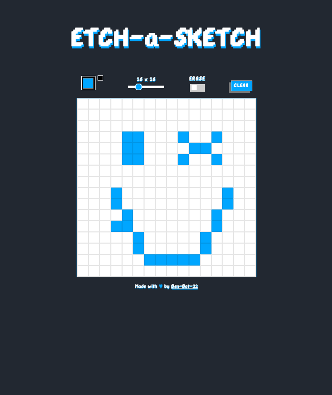

# Etch a Sketch

This is a solution to the "Etch-a-Sketch" project in the [Odin Project](https://www.theodinproject.com/lessons/foundations-rock-paper-scissors).  The Odin project is a open source tutorial for learning web development.

## Table of contents

- [Overview](#overview)
  - [The challenge](#the-challenge)
  - [Screenshot](#screenshot)
  - [Links](#links)
- [My process](#my-process)
  - [Built with](#built-with)
  - [What I learned](#what-i-learned)
- [Author](#author)

## Overview

### The challenge

Users click and drag on a canvas to create pixel art.  

### Screenshot



### Links

- Solution URL: [Code on GitHub](https://github.com/Ben-Bot-22/odin-etch-a-sketch)
- Live Site URL: [GitHub pages live URL]()

## My process

### Built with

- Semantic HTML5 markup
- CSS custom properties
- JavaScript (vanilla)
- Visual Studio Code

### What I learned

1) I used CSS grid to layout pixels in the canvas.
`````
  display: grid;
  grid-template-columns: repeat(var(--pixel-rows), 1fr);
  grid-template-rows: repeat(var(--pixel-rows), 1fr);
`````
2) While checking the site in Firefox, I discovered that Firefox has an image drag feature. When dragging on the canvas, pixels started to stick to the cursor.  I had to disable this feature with attributes on the body tag in HTML.  

`````
<body ondragstart="return false;" ondrop="return false;">
`````
3) I picked a custom pixelated font called [DPComic by odeman38](https://www.1001fonts.com/dpcomic-font.html). Previously, I only used Adobe or Google fonts.  To use [DPComic](https://www.1001fonts.com/dpcomic-font.html) I used [Font Squirrel](https://www.fontsquirrel.com/tools/webfont-generator) to generate .woff files & added a @font-face selector to import the font for use in CSS.  
`````
@font-face {
  font-family: "dpcomicregular";
  src: url("./font/dpcomic-webfont.woff2") format("woff2"),
    url("./font/dpcomic-webfont.woff") format("woff");
  font-weight: normal;
  font-style: normal;
}
`````
4) To change all the colors on the page to match the color selected, I learned how to update a [CSS variable with javascript](https://css-tricks.com/updating-a-css-variable-with-javascript/). 
`````
CSS
:root {
  --color: rgb(0, 166, 255);
}

JavaScript
  root.style.setProperty("--color", color);
`````
5) I ran into an issue with the clear canvas button.  I originally used "getElementsByClassName" to clear the pixels.  When iterating through the pixels, only some were reset to white.  I learned ["getElementsByClassName"](https://developer.mozilla.org/en-US/docs/Web/API/Document/getElementsByClassName) uses a live array referencing the DOM.  Every time I removed a ".filled" class from the array in my for loop, those elements were automatically removed from the array.  This made the "pixels.length" shorter and exited early.  Using "querySelecctorAll" fixed the issue because it returned a NodeList that was not automatically updated.

`````
Original with document.getElementsByClassName

  const pixels = document.getElementsByClassName("filled");
  for (let i = 0; i < pixels.length; i++) {
    console.log(pixels[i]);
    pixels[i].style.backgroundColor = eraseColor;
    pixels[i].classList.remove("filled");
  }

Final with document.querySelectorAll

  const pixels = document.querySelectorAll(".filled");
  pixels.forEach((pixel) => {
    pixel.style.backgroundColor = eraseColor;
    pixel.classList.remove("filled");
  });
`````

## Author

- Twitter - [@benBot22](https://www.twitter.com/benBot22)

